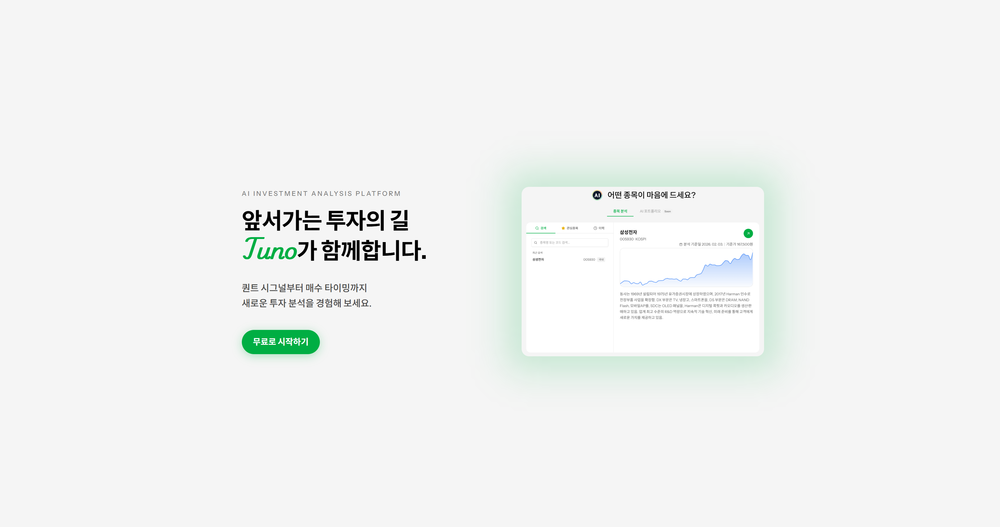

# tuno-frontend

> AI 기반 주식 분석 플랫폼 tuno의 프론트엔드

## 관련 레포지토리

| 서비스 | 설명 | 링크 |
|--------|------|------|
| **tuno-frontend** | Next.js 웹 클라이언트 (현재) | - |
| tuno-backend | Express API 서버 | [GitHub](https://github.com/hiib1206/tuno-backend) |
| tuno-ai | FastAPI 기반 AI/ML 파이프라인 | [GitHub](https://github.com/hiib1206/tuno-ai) |
| tuno-ws | 실시간 WebSocket 서버 | [GitHub](https://github.com/hiib1206/tuno-ws) |
| tuno-infra | Docker/Nginx 인프라 구성 | [GitHub](https://github.com/hiib1206/tuno-infra) |

## 데모

**[https://tunoinvest.com](https://tunoinvest.com)**



## 왜 만들었는가

기존 주식 분석 서비스들은 대부분 단순 차트와 뉴스 제공에 그치거나, AI 분석 기능이 있더라도 블랙박스처럼 결과만 보여주는 경우가 많았습니다.

**tuno**는 이런 문제를 해결하기 위해 시작한 개인 프로젝트입니다:

- **AI 분석의 투명성**: Snapback/Quant Signal 등 AI 모델의 분석 과정과 근거를 함께 제공
- **실시간 데이터**: WebSocket 기반 실시간 시세와 호가 정보
- **통합 플랫폼**: 분석, 커뮤니티, 뉴스를 한 곳에서 제공

이 프로젝트를 통해 Next.js App Router, 실시간 데이터 처리, AI 서비스 연동 등 풀스택 개발 역량을 쌓고자 했습니다.

## 주요 기능

### AI 주식 분석
- **Snapback 분석**: 종목별 가격 반등 가능성 AI 분석
- **Quant Signal**: 퀀트 전략 기반 매매 시그널 (비동기 처리)
- 분석 이력 관리 및 결과 조회

### 실시간 시장 데이터
- WebSocket 기반 **실시간 시세** 업데이트
- 일봉 캔들 차트
- 호가창 및 체결 데이터
- 재무제표 조회

### 관심종목 관리
- 드래그앤드롭으로 순서 변경
- 실시간 시세 반영

### 커뮤니티
- Tiptap 에디터 기반 게시판
- 종목별 토론방
- 뉴스 피드

### 사용자 기능
- 회원가입/로그인 (이메일 인증)
- 대시보드 (요금제, API 사용량)
- SSE 기반 실시간 알림

## 기술 스택

### Core
| 기술 | 버전 |
|------|------|
| **Next.js** | 16 (App Router) |
| **React** | 19 |
| **TypeScript** | 5.9 |

### 상태 관리
| 기술 | 용도 |
|------|------|
| **Zustand** | 클라이언트 전역 상태 (auth, watchlist, theme) |
| **TanStack Query** | 서버 상태 관리, 캐싱, 리페칭 |

### UI/UX
| 기술 | 용도 |
|------|------|
| **TailwindCSS 4** | 유틸리티 기반 스타일링 |
| **Radix UI** | 접근성 준수 헤드리스 컴포넌트 |
| **Framer Motion** | 페이지 전환, 인터랙션 애니메이션 |

### 차트
| 기술 | 용도 |
|------|------|
| **Lightweight Charts** | 캔들/라인 차트 (TradingView 오픈소스) |
| **ECharts** | 복잡한 데이터 시각화 |
| **Recharts** | 간단한 통계 차트 |

### 폼
| 기술 | 용도 |
|------|------|
| **React Hook Form** | 폼 상태 관리 |

### 기타
| 기술 | 용도 |
|------|------|
| **Tiptap** | WYSIWYG 에디터 |
| **dnd-kit** | 드래그앤드롭 |
| **Axios** | HTTP 클라이언트 |

## 프로젝트 구조

```
tuno-frontend/
├── app/                    # Next.js App Router
│   ├── (workspace)/        # 인증 후 메인 레이아웃
│   │   ├── analysis/       # AI 분석 (individual, quant)
│   │   ├── dashboard/      # 대시보드 (plan, usage)
│   │   └── market/         # 시장 정보 (stock, theme)
│   ├── community/          # 커뮤니티 (posts, news, mypage)
│   ├── login/              # 로그인
│   ├── signup/             # 회원가입
│   └── page.tsx            # 랜딩 페이지
├── api/                    # API 클라이언트 모듈
├── components/             # 재사용 컴포넌트
│   ├── ui/                 # 기본 UI 컴포넌트 (Radix 기반)
│   ├── chart/              # 차트 컴포넌트
│   ├── analysis/           # 분석 관련 컴포넌트
│   ├── community/          # 커뮤니티 컴포넌트
│   └── workspace/          # 워크스페이스 레이아웃
├── hooks/                  # 커스텀 훅
│   ├── useStockWebSocket   # 실시간 시세 WebSocket
│   ├── useStockChart       # 차트 데이터 관리
│   └── useNews             # 뉴스 피드
├── stores/                 # Zustand 스토어
│   ├── authStore           # 인증 상태
│   ├── watchlistStore      # 관심종목
│   └── notificationStore   # 알림
├── types/                  # TypeScript 타입 정의
└── lib/                    # 유틸리티 함수
```

## 기술적 의사결정

### Next.js App Router 선택
기존 Pages Router 대비 서버 컴포넌트를 활용해 **초기 번들 크기를 줄이고**, 레이아웃 중첩으로 페이지 전환 시 공통 UI를 유지할 수 있었습니다. 특히 주식 데이터처럼 자주 변경되는 데이터는 클라이언트 컴포넌트로, 정적인 UI는 서버 컴포넌트로 분리해 최적화했습니다.

### Zustand + TanStack Query 조합
- **Zustand**: 인증, 테마 등 클라이언트 전용 상태
- **TanStack Query**: API 응답 캐싱, 백그라운드 리페칭, 낙관적 업데이트

Redux 대비 보일러플레이트가 적고, 관심사 분리가 명확해 선택했습니다.

### 실시간 데이터 처리
- **WebSocket**: 주식 시세처럼 빈번한 양방향 통신
- **SSE**: 알림처럼 서버 → 클라이언트 단방향 통신

용도에 맞게 기술을 분리해 리소스 효율성을 높였습니다.

### Lightweight Charts 선택
TradingView의 오픈소스 차트 라이브러리로, **금융 데이터에 최적화**되어 있고 번들 크기가 작습니다. 캔들 차트, 볼륨, 기술적 지표 표시에 적합했습니다.

## 설치 및 실행

### 요구사항
- Node.js 20+
- pnpm

### 설치

```bash
# 의존성 설치
pnpm install

# 환경 변수 설정
cp .env.example .env
# .env 파일에 API 엔드포인트 설정
```

### 개발 서버 실행

```bash
pnpm dev
```

http://localhost:3000 에서 확인할 수 있습니다.

### 프로덕션 빌드

```bash
pnpm build
pnpm start
```

## 배운 점

- **Next.js App Router**: 서버/클라이언트 컴포넌트 경계 설계의 중요성
- **실시간 데이터**: WebSocket 연결 관리, 재연결 로직, 메모리 누수 방지
- **상태 관리**: 서버 상태 vs 클라이언트 상태의 명확한 분리
- **성능 최적화**: React.memo, useMemo, 가상화 등을 통한 대량 데이터 렌더링 최적화

## 어려웠던 점

- **WebSocket 상태 동기화**: 연결 끊김 시 데이터 일관성 유지
- **차트 성능**: 실시간으로 업데이트되는 대량의 캔들 데이터 처리
